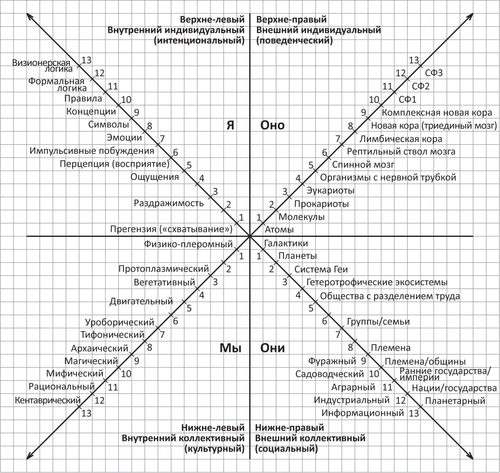

Кен Уилбер — американский мыслитель, родившийся в 1949 году, автор более двух десятков книг, написанных в жанре серьёзных теоретических исследований (эволюции человечества и Космоса, духовности и религии, психологии развития, исследований сознания, трансперсональной психологии и социологии, философии науки, эпистемологии и трансдисциплинарности и т. д.), а также популярных введений — доступных экскурсов в своё собственное богатое наследие.

Систематическое применение интегрального подхода, как подчёркивают авторы, позволяет обрести панорамное видение, охватывающее знание прошлого и настоящего человечества, самых разных дисциплин (от физики, химии и герменевтики до медитации и эзотеризма, нейробиологии, феноменологии, психологии, теории систем и др.).

::: card
В рамках интегрального методологического плюрализма выделяется восемь зон, или восемь «методологических семей», при помощи которых можно исследовать любой феномен, в том числе и религиозный опыт:

- феноменология (исследование непосредственного внутреннего опыта);
- структурализм (исследование формальных, или систематизированных, паттернов непосредственного внутреннего опыта);
- теория автопоэза (исследования процессов поведенческой саморегуляции);
- эмпиризм (исследование объективно наблюдаемых поведенческих проявлений);
- теория социального автопоэза (исследование динамики саморегуляции социальных систем);
- теория систем (исследование процессов функционального приспособления частей социальной системы к поддающемуся наблюдению целому);
- герменевтика (исследование межсубъективных полей смыслов и понимания изнутри культуры) и
- этнометодология (исследование формальных паттернов взаимопонимания извне культуры).

:::

::: card

## Квадранты

<integral-quadrants :quadrants="$frontmatter.quadrants" />

:::

::: card

## Стадии развития

:::

::: card

## AQAL

:::

::: card

Введение в изучение интегральной философии Кена Уилбера — Журнал «Эрос и Космос», https://eroskosmos.org/ken-wilber-introduction/

:::
